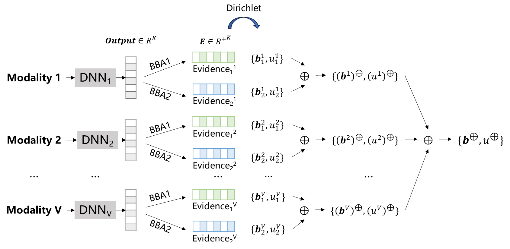

# DDEF



This work is proposed for Dual-Level Deep Evidential Fusion (DDEF): Integrating Multimodal Information for Enhanced Reliable Decision-Making in Deep Learning. DDEF is accurate, efficient, reliable, scalable, and very simple in design.

## Codes

'utils.py' defined some shows details of Experiment 1.

'train.py' shows details of Experiment 1 on MNIST-SVHN.

## Data

You can download SVHN data at http://ufldl.stanford.edu/housenumbers/

Other data can be found in  `/data`

## Citation

If you find this repository helpful, please consider citing:

```
@article{shao2024dual,
  title={Dual-level Deep Evidential Fusion: Integrating multimodal information for enhanced reliable decision-making in deep learning},
  author={Shao, Zhimin and Dou, Weibei and Pan, Yu},
  journal={Information Fusion},
  volume={103},
  pages={102113},
  year={2024},
  publisher={Elsevier}
}
```
